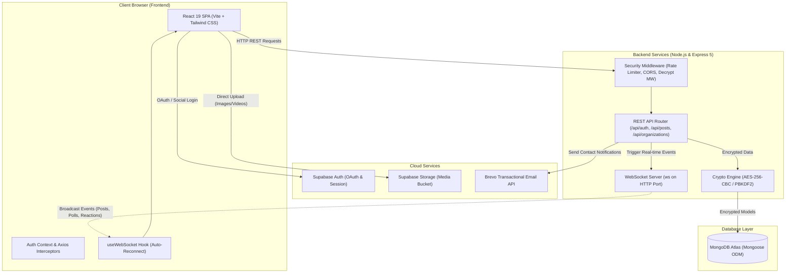

<div align="center">

# 🛡️ VoiceBox Anonymous

**Enterprise-Grade Anonymous Workplace Feedback, Suggestion Box, Whistleblowing & Live Polling Platform**

[](https://react.dev/)
[](https://vitejs.dev/)
[](https://tailwindcss.com/)
[](https://nodejs.org/)
[](https://expressjs.com/)
[](https://www.mongodb.com/)
[](https://supabase.com/)
[](https://github.com/websockets/ws)
[](https://nodejs.org/api/crypto.html)

<p align="center">
  <a href="#-key-features">Key Features</a> •
  <a href="#-system-architecture">Architecture</a> •
  <a href="#-repository-structure">Repository Structure</a> •
  <a href="#-getting-started">Getting Started</a> •
  <a href="#-security--privacy-architecture">Security & Privacy</a> •
  <a href="#-subsystem-documentation">Subsystem Docs</a> •
  <a href="#-license--author">License & Author</a>
</p>

</div>

---

## 📖 Executive Overview

**VoiceBox Anonymous** is a privacy-first communication platform built for modern organizations, enterprises, and educational institutions. It bridges the gap between management and employees by providing a safe, strictly anonymous channel for authentic feedback, complaints, whistleblower reports, constructive suggestions, and real-time pulse polls.

By combining **AES-256-CBC End-to-End Encryption (E2EE)** with **Zero-Knowledge identity decoupling**, VoiceBox Anonymous guarantees that employee identities are never exposed in public feeds, comments, reactions, or database records—even to database administrators or organization owners—while maintaining robust verification mechanisms to prevent impersonation and spam.

---

## ⚡ Key Features

### 🔒 Privacy & Cryptographic Protection
- **Zero-Knowledge Identity Decoupling**: Submissions are stored and queried without persisting public user IDs. Submissions are flagged as anonymous by default.
- **AES-256-CBC Payload Encryption**: Post text, comments, and poll options are encrypted before reaching the database using Node.js `crypto` with PBKDF2 key derivation (100,000 iterations, SHA-512) and decrypted only in authorized response pipelines.
- **Dual-Token Authentication**: Secure access token generation (Bearer) paired with HTTP-only, `SameSite=Strict` refresh token cookies for seamless session rotation.

### 🏢 Multi-Tenant Organization Management
- **Domain & Whitelist Verification**: Administrators can register organizations and strictly control employee access via whitelist pools (up to 25 verified employee emails and up to 5 delegated co-admin emails).
- **Strict Role-Based Access Control (RBAC)**: Fine-grained permissions separating `admin`, `co-admin`, and `employee` capabilities across routes and dashboard features.
- **Co-Admin Delegation**: Primary administrators can designate trusted colleagues as co-administrators to review feedback, pin key notices, and launch organizational polls.

### 💬 Rich Anonymous Communication & Feed
- **Categorized Submissions**: Posts can be categorized as **Feedback**, **Complaint**, **Suggestion**, or **Public Discussions**, tagged by geographic region and internal department.
- **Interactive Multi-Media Uploads**: Direct-to-cloud media attachments (images and videos up to 10MB) powered by Supabase Storage with client-side progress bars and custom media modal viewers.
- **Threaded Comments & Moderator Pins**: Employees can engage in threaded discussions; admins can pin critical posts and official replies to the top of feeds.
- **Emoji Reactions**: Real-time reaction engine (`like`, `love`, `laugh`, `angry`) with per-user deduplication.

### 📊 Real-Time Pulse Polling & Analytics
- **Live WebSocket Synchronisation**: All posts, comments, reactions, and live poll updates are broadcast instantly via a high-performance WebSocket server without manual page refreshes.
- **Organizational Polling Engine**: Administrators can launch single-vote polls with custom choices, monitor live percentage distributions, and gracefully stop voting when conclusions are reached.
- **Interactive Visual Analytics**: Comprehensive Chart.js visualizations breaking down submission volumes by department, region, and post category.

### 🎨 Modern Responsive User Experience
- **Fluid Dark / Light Mode**: Dynamic theme switcher with automatic state preservation in `localStorage` and synchronized Tailwind CSS styling.
- **Modern Micro-Interactions**: Built using Framer Motion animations, Headless UI accessible dialogs, and toast notifications.
- **SEO & Social Sharing Ready**: React Helmet metadata, OpenGraph tags, dynamic Twitter cards, canonical tags, and structured Schema.org JSON-LD.

---

## 🏗️ System Architecture



---

## 📂 Repository Structure

```
voicebox-anonymous/
├── backend/                       # Server-side REST API & WebSocket service
│   ├── controllers/               # Route business logic
│   │   ├── authController.js      # User registration, verification & session logic
│   │   ├── mailController.js      # Brevo transactional email dispatcher
│   │   ├── orgController.js       # Organization CRUD, employee/co-admin whitelisting
│   │   └── postController.js      # Posts, comments, reactions, pins & live polling
│   ├── middleware/                # Express interceptors & request handlers
│   │   ├── auth.js                # JWT verification, RBAC guard & speed limiters
│   │   ├── decryptMiddleware.js   # Intercepts res.json to decrypt outgoing models
│   │   ├── errorHandler.js        # Global unhandled error & JSON response handler
│   │   ├── logger.js              # HTTP request & response status logger
│   │   └── validation.js          # Express-validator schemas for emails & ObjectIds
│   ├── models/                    # Mongoose database models & pre/post hooks
│   │   ├── Organization.js        # Multi-tenant organization & member email schema
│   │   ├── Post.js                # Post, comment, reaction, and poll subdocument schema
│   │   └── User.js                # User identity, password hash, role & verification
│   ├── routes/                    # API route declarations
│   │   ├── authRoutes.js          # /api/auth endpoints
│   │   ├── mailRoutes.js          # /api/mail endpoints
│   │   ├── orgRoutes.js           # /api/organizations endpoints
│   │   └── postRoutes.js          # /api/posts endpoints
│   ├── utils/                     # Backend utilities
│   │   ├── cryptoUtils.js         # PBKDF2 key derivation & AES-256-CBC cipher
│   │   └── supabaseClient.js      # Supabase server admin client
│   ├── .env                       # Backend environment configuration
│   ├── index.js                   # Application entry point, Express app & WebSocket server
│   ├── package.json               # Backend dependencies & runtime scripts
│   └── README.md                  # Comprehensive backend technical manual
│
├── frontend/                      # Client-side Single Page Application (SPA)
│   ├── public/                    # Static assets, robots.txt, manifest.json
│   ├── src/
│   │   ├── api/                   # API client layer & Axios interceptor configurations
│   │   ├── assets/                # Logos, SVG icons, visual media
│   │   ├── components/            # Reusable UI widgets & page sections
│   │   │   ├── common/            # Shared primitives (CommentSection, ReactionButton, Modal, ThemeToggle)
│   │   │   ├── home/              # Landing page components (Hero, Features, TestimonialOrbit)
│   │   │   ├── DeletionConfirmation.jsx # Safety modal for deletions
│   │   │   ├── MediaViewer.jsx    # Image/Video modal lightbox
│   │   │   ├── Polling.jsx        # Live polling card with voting actions
│   │   │   ├── PostCreation.jsx   # Rich post / poll submission interface
│   │   │   ├── PostEditModal.jsx  # Edit post dialogue
│   │   │   ├── ProtectedRoute.jsx # Role-based route authorization guard
│   │   │   ├── SEO.jsx            # Dynamic page title and OpenGraph metadata
│   │   │   └── Sidebar.jsx        # Dashboard collapsible navigation bar
│   │   ├── context/               # Global React context providers
│   │   │   └── AuthContext.jsx    # User authentication, token lifecycle & active session
│   │   ├── hooks/                 # Custom React hooks
│   │   │   ├── useDecryption.js   # Client-side decryption helper
│   │   │   ├── useTheme.js        # Light/Dark mode state hook
│   │   │   └── useWebSocket.js    # Persistent WebSocket client with exponential backoff
│   │   ├── pages/                 # Full-screen page views
│   │   │   ├── AdminDashboard.jsx # Admin management console, statistics & mod tools
│   │   │   ├── AuthCallback.jsx   # OAuth redirect handler
│   │   │   ├── EmployeeDashboard.jsx # Employee feed, submission form & poll voter
│   │   │   ├── EmployeeVerification.jsx # Whitelist verification flow
│   │   │   ├── ForgotPassword.jsx # Password reset initiation
│   │   │   ├── Home.jsx           # Public marketing landing page
│   │   │   ├── PricingPage.jsx    # Subscription tier comparison
│   │   │   ├── SignIn.jsx         # Sign-in portal (credentials & OAuth)
│   │   │   ├── SignUp.jsx         # Account creation portal
│   │   │   ├── Subscriptions.jsx  # Tier billing management
│   │   │   ├── TermsPolicy.jsx    # Legal Terms & Privacy disclosures
│   │   │   └── UpdatePassword.jsx # Password reset completion
│   │   ├── utils/                 # Frontend utilities (Axios instance, crypto, media upload)
│   │   ├── App.jsx                # Router setup, page routes & global layout
│   │   ├── index.css              # Tailwind base, components & utilities
│   │   ├── main.jsx               # React DOM mounting entry point
│   │   └── supabaseClient.js      # Supabase client-side SDK initialization
│   ├── .env                       # Frontend environment configuration
│   ├── package.json               # Frontend dependencies & Vite scripts
│   ├── tailwind.config.js         # Tailwind styling tokens & keyframe animations
│   ├── vite.config.js             # Vite bundler plugins and settings
│   └── README.md                  # Comprehensive frontend technical manual
│
├── package.json                   # Root package descriptor
└── README.md                      # Primary project portal (this document)
```

---

## 🚀 Getting Started

### Prerequisites

Ensure the following tools and services are installed and configured:
- **Node.js**: `v18.x` or higher (v20+ recommended)
- **Package Manager**: `npm` (v9+) or `yarn` / `pnpm`
- **MongoDB**: A local instance or a free [MongoDB Atlas](https://www.mongodb.com/atlas) cluster connection URI
- **Supabase Project**: Free [Supabase](https://supabase.com/) account with an active project:
  - Auth enabled (Email/Password and optional OAuth providers)
  - Storage bucket created named `media` with public read access
- **Brevo Account**: (Optional, for contact form emails) API Key from [Brevo](https://www.brevo.com/)

---

### Step 1: Clone the Repository

```bash
git clone https://github.com/Biki-hacker/VoiceboxAnonymous.git
cd voicebox-anonymous
```

---

### Step 2: Configure Environment Variables

#### 1. Backend Environment (`backend/.env`)

Create a `.env` file inside the `backend/` folder:

```bash
# Server Port & Execution Mode
PORT=5000
NODE_ENV=development

# Database Connection (MongoDB Atlas or Local)
MONGO_URI=mongodb+srv://<username>:<password>@cluster.mongodb.net/voicebox?retryWrites=true&w=majority

# Security & JSON Web Tokens
JWT_SECRET=your_super_strong_random_jwt_secret_minimum_64_characters
REFRESH_TOKEN_SECRET=your_super_strong_refresh_token_secret_minimum_64_characters

# Cryptographic Engine (AES-256-CBC)
ENCRYPTION_KEY=your_secure_32_character_encryption_key_here
ENCRYPTION_SALT=your_secure_random_salt_value_here

# Supabase Admin / Service Keys
SUPABASE_URL=https://<your-project-id>.supabase.co
SUPABASE_KEY=your_supabase_anon_public_key
SUPABASE_SERVICE_ROLE_KEY=your_supabase_service_role_key

# Brevo (Sendinblue) Transactional Mail (Optional)
BREVO_API_KEY=xkeysib-your_brevo_api_key
YOUR_RECEIVING_EMAIL=admin@yourdomain.com
BREVO_SENDER_EMAIL=noreply@yourdomain.com

# CORS Allowed Origin
FRONTEND_URL=http://localhost:5173
```

#### 2. Frontend Environment (`frontend/.env`)

Create a `.env` file inside the `frontend/` folder:

```bash
# Supabase Configuration
VITE_SUPABASE_URL=https://<your-project-id>.supabase.co
VITE_SUPABASE_ANON_KEY=your_supabase_anon_public_key

# Backend API Endpoints
VITE_API_URL=http://localhost:5000/api
VITE_API_BASE_URL=http://localhost:5000/api

# WebSocket Server Endpoint
VITE_WS_URL=ws://localhost:5000
```

---

### Step 3: Install Dependencies

Open two terminal tabs to install dependencies for both services:

```bash
# Terminal 1: Backend
cd backend
npm install

# Terminal 2: Frontend
cd frontend
npm install
```

---

### Step 4: Run the Development Servers

```bash
# Terminal 1: Run the Backend (Nodemon hot reload)
cd backend
npm run dev

# Terminal 2: Run the Frontend (Vite dev server)
cd frontend
npm run dev
```

Once running:
- **Frontend App**: [http://localhost:5173](http://localhost:5173)
- **Backend API**: [http://localhost:5000/api](http://localhost:5000/api)
- **WebSocket Endpoint**: `ws://localhost:5000`
- **Health Check**: [http://localhost:5000/health](http://localhost:5000/health)

---

## 🔐 Security & Privacy Architecture

| Security Layer | Implementation Detail | Purpose |
| :--- | :--- | :--- |
| **Payload Encryption** | AES-256-CBC via OpenSSL crypto primitives with PBKDF2 salt | Protects post contents, comments, and poll options at rest in the database. |
| **Identity Protection** | Role-based pseudo-anonymity; no author identifiers stored in readable post outputs | Eliminates fear of retribution or bias against employees. |
| **Session Hardening** | Short-lived access JWTs (15–60 min) + HTTP-only, `SameSite=Strict` refresh tokens | Mitigates XSS-based token theft while maintaining frictionless user sessions. |
| **Traffic Throttling** | `express-rate-limit` & `express-slow-down` | Protects auth routes against brute-force attacks and shields contact forms from spam. |
| **HTTP Security Headers** | `X-Content-Type-Options: nosniff`, `X-Frame-Options: DENY`, `X-XSS-Protection` | Shields users against clickjacking, MIME-sniffing, and cross-site scripting attacks. |
| **Validation & Sanitization** | `express-validator` schema enforcement with Regex checks | Prevents MongoDB injection and invalid data propagation. |

---

## 📚 Subsystem Documentation

For in-depth technical documentation, API specifications, and architecture breakdowns of each service, refer to their dedicated documentation files:

- 💻 **[Frontend Documentation](file:///media/devbiki/New%20Volume/voicebox-anonymous/frontend/README.md)**: Component hierarchy, routing architecture, state management, WebSocket hook details, media pipeline, and build instructions.
- ⚙️ **[Backend Documentation](file:///media/devbiki/New%20Volume/voicebox-anonymous/backend/README.md)**: Complete REST API catalog, WebSocket event protocol specifications, database schema diagrams, crypto middleware, and deployment guides.

---

## 🛠️ Tech Stack Summary

```
Frontend:   React 19, Vite 6, Tailwind CSS 3, Framer Motion 12, Headless UI 2, Lucide & Heroicons, Chart.js 4, Axios
Backend:    Node.js, Express 5, Mongoose 8, WebSocket (ws 8), JWT, BcryptJS, Express Rate Limit, Brevo SDK
Storage:    MongoDB Atlas (Document Store), Supabase Storage (Media Attachments)
Auth:       Supabase Auth (OAuth & Social Login) + Custom JWT Session Engine
```

---

## 🤝 Contributing

Contributions, bug reports, and feature requests are welcome!

1. Fork the Project
2. Create your Feature Branch (`git checkout -b feature/AmazingFeature`)
3. Commit your Changes (`git commit -m 'feat: add some amazing feature'`)
4. Push to the Branch (`git push origin feature/AmazingFeature`)
5. Open a Pull Request

---

## 📄 License & Author

Distributed under the **ISC License**.

Created and maintained with ❤️ by **[Souvik Dhara](https://github.com/Biki-hacker)**.

---

<div align="center">
  <sub>Built for transparent, fearless, and empowered workplaces.</sub>
</div>